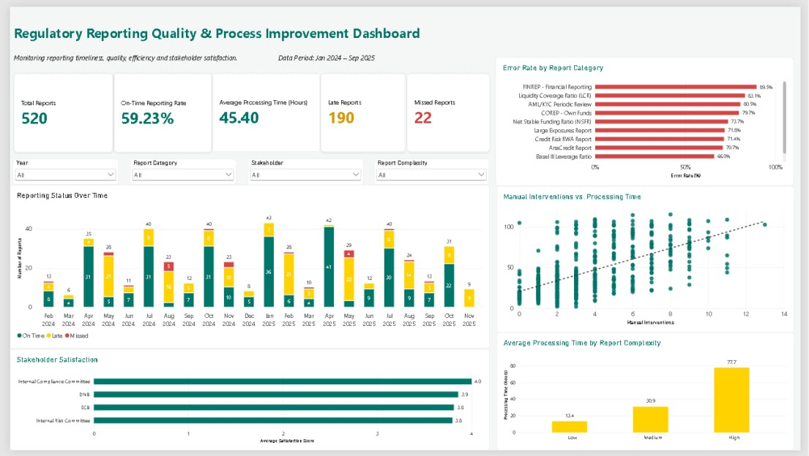

# Regulatory Reporting Quality & Process Improvement Dashboard

An interactive Power BI dashboard designed to explore regulatory reporting performance, data quality, process efficiency, and stakeholder satisfaction.

> **Disclaimer:** This is an independent portfolio project created using synthetic data for learning and demonstration purposes. It does not contain ABN AMRO data and is not an official ABN AMRO project.

## Dashboard Preview



## Project Purpose

I created this project to strengthen my practical understanding of regulatory reporting and to apply my data analysis skills to a realistic reporting scenario.

The dashboard focuses on identifying reporting delays, data quality issues, processing inefficiencies, and patterns that may support process improvement and better decision-making.

## Tools & Technologies

- Power BI Desktop
- Power Query
- DAX
- Data Modeling
- Data Visualization
- GitHub

## Dashboard Features

- Interactive filtering by year, report category, stakeholder, and report complexity
- KPI monitoring for total reports, on-time reporting rate, late reports, missed reports, and average processing time
- Reporting status analysis over time
- Error rate analysis by report category
- Analysis of manual interventions versus processing time
- Stakeholder satisfaction monitoring
- Processing time analysis by report complexity

## Dataset

The project uses a synthetic regulatory reporting dataset containing 520 reporting records covering the period from January 2024 to September 2025.

The dataset includes information such as:

- Reporting period and submission dates
- Report category and responsible team
- Reporting status
- Error count
- Manual interventions
- Processing time
- Report complexity
- Stakeholder satisfaction

The data was cleaned and transformed in Power Query before being modeled and analyzed in Power BI.

## Data Preparation & Modeling

The dataset was prepared in Power Query and modeled in Power BI to support interactive analysis.

Key preparation and modeling steps included:

- Validating data quality and checking for duplicate report IDs
- Creating reporting year, period type, quarter, and status indicators
- Creating flags for on-time, late, missed, and error-containing reports
- Grouping responsible teams into broader analytical categories
- Creating custom sort orders for reporting status and report complexity
- Creating a dedicated Date table
- Building a one-to-many relationship between the Date table and submission dates
- Creating DAX measures for KPIs such as on-time reporting rate, error rate, and average processing time

## Key DAX Measures

The dashboard uses reusable DAX measures that respond dynamically to the selected filters.

```DAX
Total Reports =
COUNTROWS('regulatory_reporting_dataset')

On-Time Reporting Rate =
DIVIDE(
    SUM('regulatory_reporting_dataset'[Is_On_Time]),
    [Total Reports]
)

Error Rate =
DIVIDE(
    [Reports With Errors],
    [Total Reports]
)

Average Processing Time (Hours) =
AVERAGE('regulatory_reporting_dataset'[Processing_Time_Hours])
```

## Key Insights

Within this synthetic dataset:

- The overall on-time reporting rate is **59.2%**, indicating room for improvement in reporting timeliness.
- **190 reports** were submitted late and **22 reports** were missed.
- Higher report complexity is associated with longer average processing times:
  - Low complexity: **13.4 hours**
  - Medium complexity: **30.9 hours**
  - High complexity: **77.7 hours**
- The analysis shows a positive relationship between manual interventions and processing time.
- Error rates vary considerably across report categories, helping identify areas that may require further investigation.

These findings demonstrate how reporting data can be used to identify potential process bottlenecks and support data-driven process improvement.
